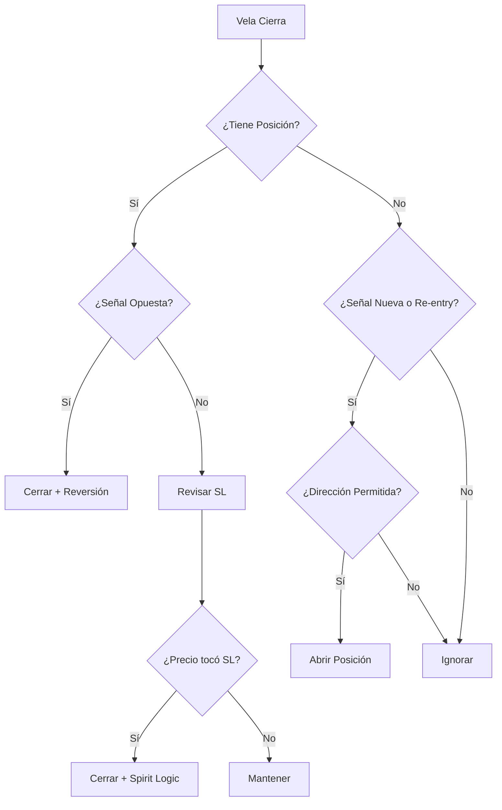

# 📊 HYDRA BOT - Guía de Estrategias y Stop Loss

## 🎯 Estrategias de Entrada

### 1. CLOSE_ENTRY (Por Defecto)
**Comportamiento:**
- Espera a que la vela actual **cierre completamente**
- Si al cierre el Range Filter indica "Buy" → Abre LONG
- Si al cierre el Range Filter indica "Sell" → Abre SHORT
- **No re-entra** después de un Stop Loss

```
Vela N cierra → Señal Buy → Abre LONG inmediatamente
```

**Pros:** Menor ruido, señales más confirmadas
**Contras:** Puede perder parte del movimiento inicial

---

### 2. OPEN_ENTRY
**Comportamiento:**
- Detecta la señal al cierre de la vela
- **Espera a la apertura de la SIGUIENTE vela** para ejecutar
- Usa el precio de apertura de la nueva vela

```
Vela N cierra con señal → Vela N+1 abre → Ejecuta orden
```

**Pros:** Menos slippage en mercados volátiles
**Contras:** Mayor delay en la entrada

---

### 3. SPIRIT (Re-entrada Básica)
**Comportamiento:**
- Si sale por **Stop Loss**, se prepara para re-entrar
- Re-entra **inmediatamente al mismo precio** si la señal sigue activa
- Confía en que la tendencia continúa después del retroceso

```
LONG abierto → Stop Loss hit → Señal sigue Buy → Re-abre LONG al precio del SL
```

**Pros:** Aprovecha tendencias fuertes con retrocesos temporales
**Contras:** Puede acumular pérdidas en mercado lateral

---

### 4. SPIRIT_IMPROVED (Re-entrada Mejorada)
**Comportamiento:**
- Como SPIRIT, pero **espera al cierre de la siguiente vela** antes de re-entrar
- Evita re-entrar durante una caída en cascada
- Usa el precio de mercado de la nueva vela, no el precio del SL

```
Stop Loss hit → Espera cierre vela siguiente → Si señal válida → Re-entra a precio de mercado
```

**Pros:** Más seguro que SPIRIT básico
**Contras:** Puede perder oportunidades si la reversión es rápida

---

### 5. SPIRIT_TRAILING (Re-entrada con Trailing)
**Comportamiento:**
- Como SPIRIT, pero también re-entra después de **Trailing Stop**
- Útil cuando el trailing corta ganancias prematuramente

```
Trailing Stop hit → Si señal sigue activa → Re-entra para seguir la tendencia
```

**Pros:** Maximiza ganancias en tendencias largas
**Contras:** Riesgo de múltiples re-entradas en volatilidad

---

### 6. SPIRIT_EXPERIMENTAL 🧪
**Comportamiento:**
1. Abre posición al cierre de la vela con señal
2. **Espera a que cierre la SIGUIENTE vela**
3. Coloca el Stop Loss en el **precio de cierre de esa vela** (no precio fijo)
4. Si es tocado, re-entra en la siguiente vela

```
Vela N cierra con señal Buy → Abre LONG
Vela N+1 cierra a 0.0178 → SL se fija en 0.0178
Precio toca 0.0178 → Cierra → Re-entry queued
```

**Lógica del SL Experimental:**
- LONG: SL = cierre de vela siguiente (se activa si precio ≤ SL)
- SHORT: SL = cierre de vela siguiente (se activa si precio ≥ SL)

**Pros:** SL se adapta a la volatilidad real del mercado
**Contras:** SL puede ser muy ajustado en mercados volátiles

---

### 7. SPIRIT_EXPERIMENTAL_FIXED 🧪
**Comportamiento:**
- Igual a SPIRIT_EXPERIMENTAL, pero introduce un **delay de 500ms** antes de activar el Stop Loss.
- Esto evita que la misma vela que fija el SL lo active instantáneamente por volatilidad extrema en el tick de cierre.
- Proporciona una "zona de seguridad" temporal.

---

### 8. BACKGUARD 🛡️
**Comportamiento Principal:**
Estrategia centrada en la precisión y la reducción de comisiones usando **Órdenes LIMIT**.

1. **Entrada Limit:**
   - Detecta señal de cierre.
   - Coloca una orden **LIMIT Real** (en modo Real) al precio de cierre de esa vela.
   - Espera a que el precio "revisite" este nivel para entrar (Maker Fees potencial).
   - *Nota: Si el precio se escapa, la orden queda pendiente (GTC) hasta reversión.*

2. **Stop Loss Inicial (Dinámico):**
   - **LONG:** Mínimo más bajo (Low) de las últimas **10 velas**.
   - **SHORT:** Máximo más alto (High) de las últimas **10 velas**.
   - Se fija al momento de la entrada.

3. **Trailing Stop Retardado:**
   - Durante las primeras **3 velas** tras la entrada, el Trailing está **INACTIVO**.
   - Después de 3 velas, se activa un **Trailing Stop del 1%**.

```
Señal Buy → Pone LIMIT @ Cierre → Fill → SL @ Min 10 velas
... 3 velas después ...
Activa Trailing 1%
```

**Pros:** Optimiza entry price y fees; SL adaptado a estructura reciente.
**Contras:** Riesgo de no entrar si el precio se dispara sin tocar el Limit.

---

## 🛡️ Modos de Stop Loss (slMode)

### FIXED (Fijo)
```
LONG:  SL = EntryPrice × (1 - stopLossPct%)
SHORT: SL = EntryPrice × (1 + stopLossPct%)
```
**Ejemplo:** Entry 100, SL 1% → SL LONG = 99, SL SHORT = 101

---

### BREAKEVEN
```
SL = EntryPrice exacto
```
Cierra la posición si el precio vuelve al punto de entrada.
**Resultado típico:** PnL ≈ 0 (solo pierde comisiones)

---

### TRAILING (Dinámico)
```
LONG:  SL = HighestPrice × (1 - trailingPct%)
SHORT: SL = LowestPrice × (1 + trailingPct%)
```
El SL sigue al precio en la dirección favorable y nunca retrocede.

**Ejemplo LONG:**
- Entry: 100, Trailing: 2%
- Precio sube a 110 → SL = 107.8
- Precio sube a 120 → SL = 117.6
- Precio baja a 117 → **CIERRA** a 117.6

---

### NONE
Sin Stop Loss activo. Solo cierra por señal de reversión.

---

## 📐 Indicador Range Filter

El bot usa **Range Filter 100** para generar señales:

| Parámetro | Valor |
|-----------|-------|
| period | 100 |
| multiplier | 3.0 |
| predictionFactor | 0.75 (hardcoded) |

### Señales:
- **Buy (LONG):** Precio > RangeFilter AND filtro subiendo
- **Sell (SHORT):** Precio < RangeFilter AND filtro bajando
- **isTrigger:** Solo es `true` cuando hay CAMBIO de señal

---

## 🔄 Flujo de Decisión



---

## 💡 Recomendaciones

| Mercado | Estrategia Recomendada | SL Mode |
|---------|------------------------|---------|
| Tendencia fuerte | SPIRIT o SPIRIT_TRAILING | TRAILING |
| Lateral/Choppy | CLOSE_ENTRY | FIXED |
| Volátil | SPIRIT_EXPERIMENTAL | Auto (experimental) |
| Conservador | CLOSE_ENTRY | BREAKEVEN |
